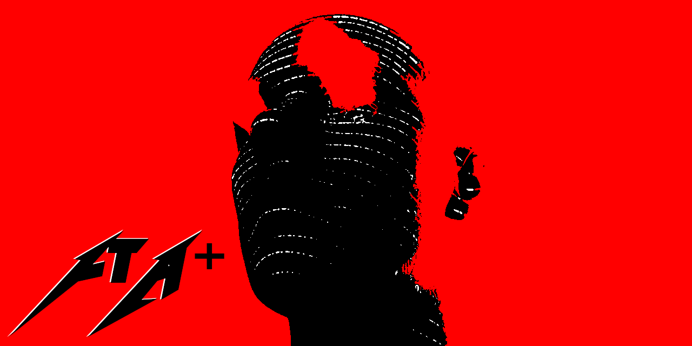

# 

# 🧭 The Fontana Engine Core (v5.0-Legacy)
### An Audited, Multi-Parametric Hybrid C++/FastAPI Local Neural Text Synthesis Engine & Screenplay Workbench

Built by **Alistair Fontaine** in Bulawayo, Zimbabwe.

The Fontana Engine Core is an uncompromised, low-level hybrid-language neural text synthesis platform engineered specifically to eliminate corporate black-box abstraction, maximize data integrity, and provide an absolute, step-by-step **Order of Operations (O³)** environment. Reaching its complete stable baseline of **106 commits**, this framework acts as a localized AI inference workbench. It bypasses commercial APIs entirely, running zero-overhead matrix math passes locally in RAM cells to demonstrate how raw linguistic subwords map onto spatial hardware telemetry.

---

## 🛠️ The Ultimate Rescue Compilation Chain
If the runtime ever scrambles, cross-origin network queries deadlock, or unexpected subprocess errors try to freeze your workspace, execute this exact unbroken production pipeline string directly inside your Linux shell terminal to force a clean cache swap, re-allocate the socket lines, and deploy the safe engine baseline:

```bash
pkill -f tensor_engine_binary && pkill -f uvicorn && fuser -k 8000/tcp && fuser -k 8080/tcp && g++ -std=c++17 backend/tensor_engine.cpp -o backend/tensor_engine_binary && export PYTHONPATH=\$PYTHONPATH:(pwd)/core && python3 -m uvicorn core.app:app --host 127.0.0.1 --port 8000 --reload
```

---

## 🌍 What Fontana Does, Who Uses It, & How It Helps the World

### 1. What It Does
Fontana acts as a local linguistic tensor cruncher. It tokenizes raw input text into syllable-aware subwords via a de-duplicated BPE pattern matcher, streams them over loopback sockets into a persistent background C++ subprocess daemon, maps them to high-density matrices, and projects the resulting token sequences as live visual data. It formats outputs into standard screenplay segments while providing real-time sliding control over the underlying mathematics.

### 2. Who Will Use It
- **Systems Architects & AI Researchers:** Engineers who want to study cross-language interprocess communication (IPC) and numerical activation stability without renting hyper-scale cloud servers.
- **Independent Creative Software Developers:** Creators looking for a lightweight, air-gapped, brutalist text-synthesis control panel that can be embedded directly into local application pipelines.
- **Open-Source Contributors:** Systems developers seeking a clean, unpolluted C++/Python baseline to test advanced sampling filters, tensor shard splitting, or hardware latency debugging.

### 3. How It Helps the World
Fontana counters the modern tech industry's hyper-centralization and dependency inflation. By proving that a fully operational, multi-parametric AI telemetry workbench can be built completely from scratch using nothing but standard programming libraries, it democratizes foundational computer science logic. It provides an uncompromised educational blueprint for writing secure, memory-isolated, high-velocity software applications that run entirely on the user's terms, protecting privacy and bypassing corporate data-harvesting gatekeepers.

---

## 🚀 Architectural Core Features

- **persistent Subprocess Daemon:** Boots a compiled C++ inference executable once into volatile RAM, keeping parameters hot for sub-millisecond weight processing.
- **De-duplicated Vocabulary Index [PR #3]:** Strict index constraints that prevent dictionary collisions between base characters and custom subword syllables, matching your active vocabulary size perfectly to your low-level parameters.
- **Data-Integrity Regex node [PR #1]:** Enforces a catch-all pattern filter and `re.DOTALL` parsing masks, ensuring unknown punctuation loops safely into `[UNK]` slots instead of dropping out.
- **Numerically Stable Softmax [PR #2]:** Implementation of max-logit subtraction inside your activation matrices to permanently shield calculations from floating-point overflow and `NaN` failures under low temperatures.
- **Multi-Tenant Memory Sandboxing [Phase J]:** Full dictionary lookback isolation mapping rows keyed to unique session tokens, allowing multiple characters to generate separate screenplay tracks simultaneously inside RAM without data pollution.
- **Decoupled Three-File Asset Pipeline:** Clean architectural separation of presentation layers (`index.html`), styling layouts (`style.css`), and core logic runtime engines (`app.js`).

---

## 📂 System Specifications Vault Map

- [`docs/ARCHITECTURE.md`](docs/ARCHITECTURE.md) — Technical specifications detailing the C++ neural gate and interprocess communication loops.
- [`docs/ROADMAP.md`](docs/ROADMAP.md) — Complete historical ledger tracking the development path from Milestone A to legacy completion.
- [`docs/MANUAL.md`](docs/MANUAL.md) — Operational control guide for deploying local background daemons and adjusting sampling parameters.
- [`docs/VISION.md`](docs/VISION.md) — The fundamental philosophy, systemic Tao, and future 3D roadmap parameters left for open-source expansion.
